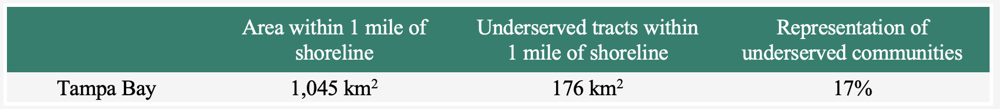
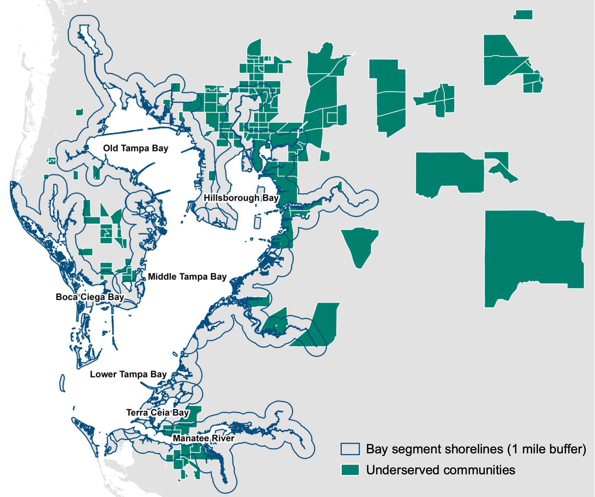
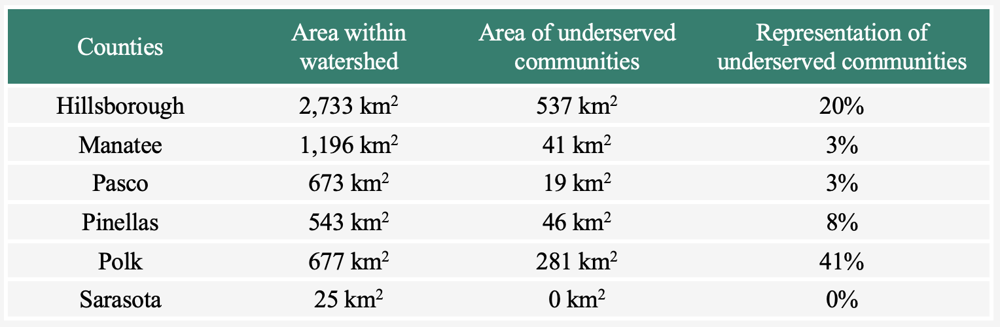

```{r setup, include=FALSE}
knitr::opts_chunk$set(echo = F, message = F, warning = F)

# libraries
library(flexdashboard)
library(shiny)
library(sf)
library(mapview)
```


Overview
===========================================================

Column {data-width=700}
-----------------------------------------------------------------------

<div class = "row">
<div class = "col-md-2"></div>
<div class = "col-md-10">

<br>

<font size='+2'><font color='#004F7E'><b>Overview of TBEP's Equity Decision Support Tool</b></font></font>

In line with the Justice40 Initiative, the Tampa Bay Estuary Program has a goal to ensure at least 40% of projects funded by the Bipartisan Infrastructure Law (BIL) benefit underserved communities in the Tampa Bay watershed. However, we hope to apply this equity target more broadly to all TBEP projects and CCMP actions, including research, outreach, and education activities. 

To help us achieve this goal, the TBEP Equity Decision Support Tool was created to assist TBEP's staff, partners, and grant applicants in evaluating and reporting the potential contributions of proposed projects to TBEP's equity target. <br>
<br>

#### What is the purpose of this tool?

Decision support tools are designed to assist decision-makers in making informed, consistent, and transparent decisions with ease. Decision science has consistently shown that these tools improve the ability of individuals to make consistent decisions over time, as well as improve the consistency of decisions across multiple decision-makers. Particularly for decisions about complex topics or topics requiring specific expertise, a decision support tool can make it easier for decision-makers to consider all of the relevant dimensions of a topic regardless of their experience or expertise.

The Equity Decision Support Tool has been designed to help any decision-maker determine if a proposed project could contribute to TBEP's equity target. The tool can be used by both experts and novices in the topic of social equity, as it walks the decision-maker through a simple evaluation of distributive, procedural, and recognitional equity of the proposed project. After answering a series of questions about the project, the tool concludes with either (1) an  assessment of the project's potential contribution to the equity target, or (2) recommendations for adapting the project or doing some additional investigation and/or consultation about the project. 

Importantly, this is a decision support tool, not a decision <i>making</i> tool. Decision-makers should always use their best judgement in making decisions, which may include considerations of context and other factors that cannot be accounted for by this tool. We encourage decision-makers to consider and report the results from this tool, and build upon these results with additional arguments for or against including the project in TBEP's contributions to the equity target.

<br>

#### How do you use the tool?

The Equity Decision Support Tool presents the user with a series of questions about the project. The majority of these questions only require a simple 'Yes' or 'No' answer. Based on the answer, the tool directs the user to the relevant follow-up question or evaluation/recommendation.

Many of the questions require specific knowledge regarding (1) the location of the project, (2) the expected benefits of the project, and (3) the characteristics of the communities that will be impacted by the project. The tool can provide some assistance in answering these questions, but in most cases, if the answer to the question is not clear, the tool will recommend gaining more information before a determination can be made about the project.

The tool is available in both a static and interactive version. The static version, shown below, illustrates the flow of the decision tree from one question to another until an evaluation or recommendation is made. The interactive version, available on the "Use the Tool" page, presents each question one at a time and automatically direct the user to the next relevant question or outcome. The interactive version also contains some helpful resources, such as maps and tables, that may help users answer some of questions regarding the location or scale of the project.
<br>
<br>

```{r, fig.align='center', out.width='100%'}

```

<br>

Citation info here: [](https://zenodo.org/badge/latestdoi/697775318){target="_blank"}

<a rel='license' href='http://creativecommons.org/licenses/by/4.0/'></a>&nbsp;&nbsp;This website is licensed under a <a rel='license' href='http://creativecommons.org/licenses/by/4.0/'>Creative Commons Attribution 4.0 International License</a>.

</div>
<div class = "col-md-2"></div>
</div>


Column {data-width=325}
-----------------------------------------------------------------------

<div class = "row">
<div class = "col-md-2"></div>
<div class = "col-md-9">

<br>

#### Additional Resources

<br>
```{r, fig.align='left', out.width='90%'}

```

<font size="3">
<b>BIL Equity Strategy</b>
<br>
The <i>Bipartisan Infrastructure Law Equity Strategy</i> published by TBEP in 2023 outlines the development of metrics to quantify the impacts of our projects within underserved communities throughout the watershed and track progress toward achieving our equity targets. Click [here](https://drive.google.com/file/d/1VG9J5cYVcfJpSHW_pPyJoOpkBFxs2fAI/view?usp=sharing) to read the entire equity strategy.
<br>
<br>
<br>
```{r, fig.align='left', out.width='90%'}

```
<br>
<b>Mapping Communities</b>
<br>
Interested in learning more about the data underpinning the Equity Strategy? The <i>TBEP Equity Strategy: Mapping</i> site provides instructions and R code for mapping underserved and overburdened communities in Tampa Bay, including an example of how to track the flow of project benefits to these communities. You can access the site [here](https://tbep-tech.github.io/equity-plan-mapping/).
<br>
<br>

If you have any questions or comments about the Equity Strategy or the Equity Decision Support Tool, you can contact [Dr. Blake Simmons](mailto:bsimmons@tbep.org).

</font> 

</div>
<div class = "col-md-2"></div>
</div>


Use the Tool
===========================================================

Column {data-width=50}
-----------------------------------------------------------------------

<div class = "row">
<div class = "col-md-2"></div>
<div class = "col-md-9">

</div>
<div class = "col-md-2"></div>
</div>


Column {data-width=600}
-----------------------------------------------------------------------

<div class = "row">
<div class = "col-md-2"></div>
<div class = "col-md-10">

```{r}
tabsetPanel(
  id = "wizard",
  type = "hidden",
  tabPanel("LOCATION", 
           HTML("<br/><font size='+2'><font color='#004F7E'><b>Equity Decision Support Tool</b></font></font><br/><br/>Is the project associated with a specific location?<br/><br/>"),
           actionButton("LOCATION_Yes", "Yes"), 
           actionButton("LOCATION_No", "No")
  ),
  tabPanel("ARCHSITE", 
           HTML("<br/><font size='+2'><font color='#004F7E'><b>Equity Decision Support Tool</b></font></font><br/><br/>Is the project within 50 meters of an archaeological site mapped by the Florida Master Site?<br/><br/>"),
           actionButton("ARCHSITE_Yes", "Yes"), 
           actionButton("ARCHSITE_No", "No"), 
           actionButton("ARCHSITE_Unsure", "Unsure")
  ),
  tabPanel("ELIGIBLE", 
           HTML("<br/><font size='+2'><font color='#004F7E'><b>Equity Decision Support Tool</b></font></font><br/><br/>Is the site listed on or potentially eligible for the National Registry?<br/><br/>"),
           actionButton("ELIGIBLE_Yes", "Yes"), 
           actionButton("ELIGIBLE_No", "No")
  ),
  tabPanel("REMAINS", 
           HTML("<br/><font size='+2'><font color='#004F7E'><b>Equity Decision Support Tool</b></font></font><br/><br/>Does the site contain human remains?<br/><br/>"),
           actionButton("REMAINS_Yes", "Yes"), 
           actionButton("REMAINS_No", "No")
  ),
  tabPanel("MULTIPLE", 
           HTML("<br/><font size='+2'><font color='#004F7E'><b>Equity Decision Support Tool</b></font></font><br/><br/>Could the project be suitable for multiple locations?<br/><br/>"),
           actionButton("MULTIPLE_Yes", "Yes"), 
           actionButton("MULTIPLE_No", "No")
  ),
  tabPanel("PROX_MULTIPLE", 
           HTML("<br/><font size='+2'><font color='#004F7E'><b>Equity Decision Support Tool</b></font></font><br/><br/>Is one of those locations within 1 mile or directly upstream of an underserved community?<br/><br/>"),
           actionButton("PROX_MULTIPLE_Yes", "Yes"), 
           actionButton("PROX_MULTIPLE_No", "No"),
           HTML("</br></br><i>Not sure? Find your project's location in the maps of underserved communities available on the <b>Resources</b> page.</i>")
  ),
  tabPanel("OUTCOME", 
           HTML("<br/><font size='+2'><font color='#004F7E'><b>Equity Decision Support Tool</b></font></font><br/><br/>Would outcomes be significantly reduced if placed near the underserved community?<br/><br/>"),
           actionButton("OUTCOME_Yes", "Yes"), 
           actionButton("OUTCOME_No", "No")
  ),
  tabPanel("ACCESS_LOCAL", 
           HTML("<br/><font size='+2'><font color='#004F7E'><b>Equity Decision Support Tool</b></font></font><br/><br/>Is it reasonable to believe underserved communities would have (at least) equal access to the project's benefits as other communities?<br/><br/>"),
           actionButton("ACCESS_LOCAL_Yes", "Yes"), 
           actionButton("ACCESS_LOCAL_No", "No")
  ),
  tabPanel("BURDEN", 
           HTML("<br/><font size='+2'><font color='#004F7E'><b>Equity Decision Support Tool</b></font></font><br/><br/>Could the project help mitigate an environmental burden flagged in the underserved community?<br/><br/>"),
           actionButton("BURDEN_Yes", "Yes"), 
           actionButton("BURDEN_No", "No")
  ),
  tabPanel("RECOGNITION", 
           HTML("<br/><font size='+2'><font color='#004F7E'><b>Equity Decision Support Tool</b></font></font><br/><br/>Do the project benefits align with reported values, needs, or priorities of the community?<br/><br/>"),
           actionButton("RECOGNITION_Yes", "Yes"), 
           actionButton("RECOGNITION_No", "No"), 
           actionButton("RECOGNITION_Unsure", "Unsure")
  ),
  tabPanel("WHY", 
           HTML("<br/><font size='+2'><font color='#004F7E'><b>Equity Decision Support Tool</b></font></font><br/><br/>Why not?<br/><br/>"),
           actionButton("WHY_Char", "Due to project characteristics"), 
           actionButton("WHY_Data", "Due to lack of data or information")
  ),
  tabPanel("IMPROVE", 
           HTML("<br/><font size='+2'><font color='#004F7E'><b>Equity Decision Support Tool</b></font></font><br/><br/>Could access be reasonably improved without significantly reducing project outcomes or increasing timelines?<br/><br/>"),
           actionButton("IMPROVE_Yes", "Yes"), 
           actionButton("IMPROVE_No", "No")
  ),
  tabPanel("PROX_SINGLE", 
           HTML("<br/><font size='+2'><font color='#004F7E'><b>Equity Decision Support Tool</b></font></font><br/><br/>Is the project located within 1 mile or directly upstream of an underserved community?<br/><br/>"),
           actionButton("PROX_SINGLE_Yes", "Yes"), 
           actionButton("PROX_SINGLE_No", "No"),
           HTML("</br></br><i>Not sure? Find your project's location in the maps of underserved communities available on the <b>Resources</b> page.</i>")
  ),
  tabPanel("BENEFIT", 
           HTML("<br/><font size='+2'><font color='#004F7E'><b>Equity Decision Support Tool</b></font></font><br/><br/>Does the project still provide some benefit to underserved communities?<br/><br/>"),
           actionButton("BENEFIT_Yes", "Yes"), 
           actionButton("BENEFIT_No", "No")
  ),
  tabPanel("HOW", 
           HTML("<br/><font size='+2'><font color='#004F7E'><b>Equity Decision Support Tool</b></font></font><br/><br/>How?<br/><br/>"),
           actionButton("HOW_Title", "Includes students or teachers from Title 1 Schools"), 
           HTML("<br/><br/>"),
           actionButton("HOW_Stake", "Includes stakeholders from underserved communities"), 
           HTML("<br/><br/>"),
           actionButton("HOW_Know", "Increases knowledge of local equity issues"), 
           HTML("<br/><br/>"),
           actionButton("HOW_Barrier", "Reduces some barrier or driver leading to inequity"), 
           HTML("<br/><br/>"),
           actionButton("HOW_Else", "Something else"), 
           HTML("<br/><br/>"),
           actionButton("HOW_Unsure", "Unsure")
  ),
  tabPanel("SCALE", 
           HTML("<br/><font size='+2'><font color='#004F7E'><b>Equity Decision Support Tool</b></font></font><br/><br/>What is the scale of the project?<br/><br/>"),
           actionButton("SCALE_Bay", "Entire bay"), 
           actionButton("SCALE_Segment", "Bay segment"), 
           actionButton("SCALE_Watershed", "Entire watershed"), 
           actionButton("SCALE_County", "County"), 
           actionButton("SCALE_Municipality", "Municipality"), 
           actionButton("SCALE_Other", "Some other region")
  ),
  tabPanel("PROX_SHORE_BAY", 
           HTML("<br/><font size='+2'><font color='#004F7E'><b>Equity Decision Support Tool</b></font></font><br/><br/>Do underserved communities make up 40% or more of the land area within 1 mile of the shoreline?<br/><br/>"),
           actionButton("PROX_SHORE_BAY_Yes", "Yes"), 
           actionButton("PROX_SHORE_BAY_No", "No"), 
           actionButton("PROX_SHORE_BAY_Unsure", "Unsure"),
           HTML("<br/><br/><i>You can use the table below to help answer this question. If you are still unsure, click 'Unsure'.<br/><br/></i>"),
           HTML(""),
           HTML("<br/><br/>")
  ),
  tabPanel("PROX_SHORE_BAYSEG", 
           HTML("<br/><font size='+2'><font color='#004F7E'><b>Equity Decision Support Tool</b></font></font><br/><br/>Do underserved communities make up 40% or more of the land area within 1 mile of the shoreline?<br/><br/>"),
           actionButton("PROX_SHORE_BAYSEG_Yes", "Yes"), 
           actionButton("PROX_SHORE_BAYSEG_No", "No"), 
           actionButton("PROX_SHORE_BAYSEG_Unsure", "Unsure"),
           HTML("<br/><br/><i>You can use the table below to help answer this question. If you are still unsure, click 'Unsure'.<br/><br/></i>"),
           HTML(""),
           HTML("<br/><br/>")
  ),
  tabPanel("PROX_REGION_WATERSHED", 
           HTML("<br/><font size='+2'><font color='#004F7E'><b>Equity Decision Support Tool</b></font></font><br/><br/>Do underserved communities make up 40% or more of the land area in this region?<br/><br/>"),
           actionButton("PROX_REGION_WATERSHED_Yes", "Yes"), 
           actionButton("PROX_REGION_WATERSHED_No", "No"), 
           actionButton("PROX_REGION_WATERSHED_Unsure", "Unsure"),
           HTML("<br/><br/><i>You can use the table below to help answer this question. If you are still unsure, click 'Unsure'.<br/><br/></i>"),
           HTML(""),
           HTML("<br/><br/>")
  ),
  tabPanel("PROX_REGION_COUNTY", 
           HTML("<br/><font size='+2'><font color='#004F7E'><b>Equity Decision Support Tool</b></font></font><br/><br/>Do underserved communities make up 40% or more of the land area in this region?<br/><br/>"),
           actionButton("PROX_REGION_COUNTY_Yes", "Yes"), 
           actionButton("PROX_REGION_COUNTY_No", "No"), 
           actionButton("PROX_REGION_COUNTY_Unsure", "Unsure"),
           HTML("<br/><br/><i>You can use the table below to help answer this question. If you are still unsure, click 'Unsure'.<br/><br/></i>"),
           HTML(""),
           HTML("<br/><br/>")
  ),
  tabPanel("PROX_REGION_CITY", 
           HTML("<br/><font size='+2'><font color='#004F7E'><b>Equity Decision Support Tool</b></font></font><br/><br/>Do underserved communities make up 40% or more of the land area in this region?<br/><br/>"),
           actionButton("PROX_REGION_CITY_Yes", "Yes"), 
           actionButton("PROX_REGION_CITY_No", "No"), 
           actionButton("PROX_REGION_CITY_Unsure", "Unsure"),
           HTML("<br/><br/><i>You can use the table below to help answer this question. If you are still unsure, click 'Unsure'.<br/><br/></i>"),
           HTML(""),
           HTML("")
  ),
  tabPanel("PROX_REGION_OTHER", 
           HTML("<br/><font size='+2'><font color='#004F7E'><b>Equity Decision Support Tool</b></font></font><br/><br/>Do underserved communities make up 40% or more of the land area in this region?<br/><br/>"),
           actionButton("PROX_REGION_OTHER_Yes", "Yes"), 
           actionButton("PROX_REGION_OTHER_No", "No"), 
           actionButton("PROX_REGION_OTHER_Unsure", "Unsure")
  ),
  tabPanel("ACCESS_REGION", 
           HTML("<br/><font size='+2'><font color='#004F7E'><b>Equity Decision Support Tool</b></font></font><br/><br/>Is it reasonable to believe underserved communities would have (at least) equal access to the project's benefits as other communities?<br/><br/>"),
           actionButton("ACCESS_REGION_Yes", "Yes"), 
           actionButton("ACCESS_REGION_No", "No")
  ),
  tabPanel("INCLUDE", 
           HTML("<br/><font size='+2'><font color='#004F7E'><b>Equity Decision Support Tool</b></font></font><br/><br/><b><font color='#00806E'>INCLUDE</font></b> <br/>The project could be included in TBEP's contributions to the equity target.<br/><br/>"),
           actionButton("STARTOVER_INC", "Start over")
  ),
  tabPanel("ADAPT", 
           HTML("<br/><font size='+2'><font color='#004F7E'><b>Equity Decision Support Tool</b></font></font><br/><br/><b><font color='#00806E'>ADAPT</font></b> <br/>With some modification, the project could contribute to TBEP's equity target.<br/><br/>"),
           actionButton("STARTOVER_A", "Start over")
  ),
  tabPanel("JUSTIFY", 
           HTML("<br/><font size='+2'><font color='#004F7E'><b>Equity Decision Support Tool</b></font></font><br/><br/><b><font color='#00806E'>JUSTIFY</font></b> <br/>The project likely won't contribute to TBEP's equity target. Report why it would be inappropriate or impossible for the project to contribute to the target.<br/><br/>"),
           actionButton("STARTOVER_J", "Start over")
  ),
  tabPanel("INVESTIGATE", 
           HTML("<br/><font size='+2'><font color='#004F7E'><b>Equity Decision Support Tool</b></font></font><br/><br/><b><font color='#00806E'>INVESTIGATE</font></b> <br/>More data or evaluation is needed to determine if the project could contribute to TBEP's equity target.<br/><br/>"),
           actionButton("STARTOVER_INV", "Start over")
  ),
  tabPanel("CONSULT", 
           HTML("<br/><font size='+2'><font color='#004F7E'><b>Equity Decision Support Tool</b></font></font><br/><br/><b><font color='#00806E'>CONSULT</font></b> <br/>Consultation with relevant TBEP staff, experts, and/or stakeholders is recommended before continuing.<br/><br/>"),
           actionButton("STARTOVER_C", "Start over")
  ),
  tabPanel("CONSULT_ARCH", 
           HTML("<br/><font size='+2'><font color='#004F7E'><b>Equity Decision Support Tool</b></font></font><br/><br/><b><font color='#00806E'>CONSULT</font></b> <br/>Consultation with relevant TBEP staff, experts, and/or stakeholders is recommended before continuing.<br/><br/><i>TBEP staff are unable to share data regarding the locations of sensitive archaeological sites in Tampa Bay with members of the public. However, we would be happy to work with you to determine if your project might be located near one of these sensitive areas. Please contact Dr. Blake Simmons (bsimmons@tbep.org) to determine the answer to this question.<br/><br/>Most projects will not be located near one of these archaeological sites. While you wait for this information, you can start this tool again, answering 'No' to this question, so that you can continue to assess the applicability of your project for our equity target.</i><br/><br/>"),
           actionButton("STARTOVER_CARCH", "Start over")
  ),
  tabPanel("RECONSIDER", 
           HTML("<br/><font size='+2'><font color='#004F7E'><b>Equity Decision Support Tool</b></font></font><br/><br/><b><font color='#00806E'>RECONSIDER</font></b> <br/>The project may be inequitable or inappropriate, and therefore is not recommended for implementation.<br/><br/>"),
           actionButton("STARTOVER_R", "Start over")
  )
)

switch_page <- function(i) {
    updateTabsetPanel(inputId = "wizard", selected = i)
  }
  
# choices
observeEvent(input$LOCATION_Yes, switch_page("ARCHSITE"))
observeEvent(input$ARCHSITE_Yes, switch_page("ELIGIBLE"))
observeEvent(input$ELIGIBLE_Yes, switch_page("REMAINS"))
observeEvent(input$ELIGIBLE_No, switch_page("MULTIPLE"))
observeEvent(input$ARCHSITE_No, switch_page("MULTIPLE"))
observeEvent(input$MULTIPLE_Yes, switch_page("PROX_MULTIPLE"))
observeEvent(input$PROX_MULTIPLE_Yes, switch_page("OUTCOME"))
observeEvent(input$OUTCOME_No, switch_page("ACCESS_LOCAL"))
observeEvent(input$PROX_SINGLE_Yes, switch_page("ACCESS_LOCAL"))
observeEvent(input$ACCESS_LOCAL_Yes, switch_page("BURDEN"))
observeEvent(input$BURDEN_Yes, switch_page("RECOGNITION"))
observeEvent(input$WHY_Char, switch_page("RECOGNITION"))
observeEvent(input$BURDEN_No, switch_page("WHY"))
observeEvent(input$ACCESS_LOCAL_No, switch_page("IMPROVE"))
observeEvent(input$ACCESS_REGION_No, switch_page("IMPROVE"))
observeEvent(input$MULTIPLE_No, switch_page("PROX_SINGLE"))
observeEvent(input$PROX_SINGLE_No, switch_page("BENEFIT"))
observeEvent(input$BENEFIT_Yes, switch_page("HOW"))
observeEvent(input$LOCATION_No, switch_page("SCALE"))
observeEvent(input$SCALE_Bay, switch_page("PROX_SHORE_BAY"))
observeEvent(input$SCALE_Segment, switch_page("PROX_SHORE_BAYSEG"))
observeEvent(input$SCALE_Watershed, switch_page("PROX_REGION_WATERSHED"))
observeEvent(input$SCALE_County, switch_page("PROX_REGION_COUNTY"))
observeEvent(input$SCALE_Municipality, switch_page("PROX_REGION_CITY"))
observeEvent(input$SCALE_Other, switch_page("PROX_REGION_OTHER"))
observeEvent(input$PROX_SHORE_BAY_No, switch_page("ACCESS_REGION"))
observeEvent(input$PROX_SHORE_BAYSEG_No, switch_page("ACCESS_REGION"))
observeEvent(input$PROX_REGION_WATERSHED_No, switch_page("ACCESS_REGION"))
observeEvent(input$PROX_REGION_COUNTY_No, switch_page("ACCESS_REGION"))
observeEvent(input$PROX_REGION_CITY_No, switch_page("ACCESS_REGION"))
observeEvent(input$PROX_REGION_OTHER_No, switch_page("ACCESS_REGION"))


observeEvent(input$PROX_SHORE_Yes, switch_page("INCLUDE"))
observeEvent(input$PROX_REGION_Yes, switch_page("INCLUDE"))
observeEvent(input$ACCESS_REGION_Yes, switch_page("INCLUDE"))
observeEvent(input$RECOGNITION_Yes, switch_page("INCLUDE"))
observeEvent(input$HOW_Title, switch_page("INCLUDE"))
observeEvent(input$HOW_Stake, switch_page("INCLUDE"))
observeEvent(input$HOW_Know, switch_page("INCLUDE"))
observeEvent(input$HOW_Barrier, switch_page("INCLUDE"))
observeEvent(input$IMPROVE_Yes, switch_page("ADAPT"))
observeEvent(input$RECOGNITION_No, switch_page("ADAPT"))
observeEvent(input$IMPROVE_No, switch_page("JUSTIFY"))
observeEvent(input$OUTCOME_Yes, switch_page("JUSTIFY"))
observeEvent(input$BENEFIT_No, switch_page("JUSTIFY"))
observeEvent(input$PROX_MULTIPLE_No, switch_page("BENEFIT"))
observeEvent(input$PROX_REGION_WATERSHED_Unsure, switch_page("INVESTIGATE"))
observeEvent(input$PROX_REGION_COUNTY_Unsure, switch_page("INVESTIGATE"))
observeEvent(input$PROX_REGION_CITY_Unsure, switch_page("INVESTIGATE"))
observeEvent(input$PROX_REGION_OTHER_Unsure, switch_page("INVESTIGATE"))
observeEvent(input$PROX_SHORE_BAY_Unsure, switch_page("INVESTIGATE"))
observeEvent(input$PROX_SHORE_BAYSEG_Unsure, switch_page("INVESTIGATE"))
observeEvent(input$RECOGNITION_Unsure, switch_page("INVESTIGATE"))
observeEvent(input$HOW_Unsure, switch_page("INVESTIGATE"))
observeEvent(input$WHY_Data, switch_page("INVESTIGATE"))
observeEvent(input$ARCHSITE_Unsure, switch_page("CONSULT_ARCH"))
observeEvent(input$REMAINS_No, switch_page("CONSULT"))
observeEvent(input$HOW_Else, switch_page("CONSULT"))
observeEvent(input$REMAINS_Yes, switch_page("RECONSIDER"))

observeEvent(input$STARTOVER_INC, switch_page("LOCATION"))
observeEvent(input$STARTOVER_INV, switch_page("LOCATION"))
observeEvent(input$STARTOVER_A, switch_page("LOCATION"))
observeEvent(input$STARTOVER_J, switch_page("LOCATION"))
observeEvent(input$STARTOVER_C, switch_page("LOCATION"))
observeEvent(input$STARTOVER_CARCH, switch_page("LOCATION"))
observeEvent(input$STARTOVER_R, switch_page("LOCATION"))

```

</div>
<div class = "col-md-2"></div>
</div>


Column {data-width=125}
-----------------------------------------------------------------------

<div class = "row">
<div class = "col-md-2"></div>
<div class = "col-md-9">

</div>
<div class = "col-md-2"></div>
</div>


Resources
===========================================================

Column {data-width=700}
-----------------------------------------------------------------------

<div class = "row">
<div class = "col-md-2"></div>
<div class = "col-md-10">

<br>

<font size='+2'><font color='#004F7E'><b>Useful Resources</b></font></font>

The interactive maps on this page can be used to help users answer questions in the Equity Decision Support Tool about the location of proposed projects relative to underserved communities in the watershed. Users can use the map zoom function to locate the area of their project.

<br>

#### Proximity to Underserved Communities

The map below shows the locations of underserved communities and areas within 1 mile of those communities.

```{r}
load(file = 'data/tb_equity.RData')
load(file = 'data/buffer_under.RData')

mapview(buffer_under, col.regions = "#F2AD00", layer.name = "1 mile buffer", alpha.regions = 0.5) + mapview(tb_equity, col.regions = "#00806E", layer.name = "Underserved Communities", alpha.regions = 0.5)
```

<br>
<br>
The map below shows the locations of flowlines in the watershed for tracking the flow of benefits to downstream underserved communities.

```{r}
load(file = 'data/tb_flowlines.RData')

mapview(tb_flowlines, color = "#004F7E", layer.name = "Flowlines", label = "GNIS_NAME") + mapview(tb_equity, col.regions = "#00806E", layer.name = "Underserved Communities", alpha.regions = 0.5)
```

<br>
<br>
<i>More resources coming soon!</i>

</div>
<div class = "col-md-2"></div>
</div>


Column {data-width=150}
-----------------------------------------------------------------------

<div class = "row">
<div class = "col-md-2"></div>
<div class = "col-md-9">

<br>


</div>
<div class = "col-md-2"></div>
</div>

